# Leaf Admin - 内容管理系统后台

<div align="center">

一个基于 Vue 3 + Element Plus 的现代化内容管理系统后台管理界面


</div>

---

## 📑 目录

- [项目简介](#-项目简介)
- [功能特性](#-功能特性)
- [技术栈](#-技术栈)
- [系统架构](#-系统架构)
- [快速开始](#-快速开始)
- [项目结构](#-项目结构)
- [功能模块详解](#-功能模块详解)
- [配置说明](#-配置说明)
- [部署方式](#-部署方式)
- [开发指南](#-开发指南)
- [常见问题](#-常见问题)
- [更新日志](#-更新日志)
- [贡献指南](#-贡献指南)
- [许可证](#-许可证)

---

## 📖 项目简介

Leaf Admin 是一个功能完善的内容管理系统（CMS）后台管理界面，专为博客、文档、知识库等内容平台设计。系统提供了直观的用户界面和强大的内容管理功能，帮助管理员高效地管理文章、用户、评论和系统设置。

### 适用场景

- 📝 博客平台管理
- 📚 在线文档系统
- 📖 知识库管理
- 📰 新闻内容管理
- 🎓 教育资源平台

---

## ✨ 功能特性

### 核心功能

- 🔐 **用户认证与授权**
  - 登录/登出
  - Token 持久化
  - 路由守卫保护

- 📝 **文章管理**
  - 文章列表查看
  - 创建/编辑/删除文章
  - 支持 Markdown 编辑器
  - 实时预览
  - 代码高亮
  - 富文本编辑

- 👥 **用户管理**
  - 用户列表
  - 用户信息编辑
  - 权限管理

- 💬 **评论管理**
  - 评论审核
  - 评论删除
  - 评论列表

- 🏷️ **分类标签**
  - 标签管理
  - 分类管理
  - 章节管理

- 📁 **文件管理**
  - 文件上传
  - 文件预览
  - 文件删除

- ⚙️ **系统设置**
  - 网站配置
  - 系统参数

- 👤 **个人中心**
  - 个人信息修改
  - 密码修改

### 界面特性

- 🎨 现代化 UI 设计
- 📱 响应式布局
- 🌙 Element Plus 组件库
- 🚀 快速加载
- 💫 流畅动画
- 🔍 智能搜索

---

## 🛠 技术栈

### 前端框架

| 技术 | 版本 | 说明 |
|------|------|------|
| [Vue 3](https://vuejs.org/) | 3.3.13 | 渐进式 JavaScript 框架 |
| [Vue Router](https://router.vuejs.org/) | 4.2.5 | 官方路由管理器 |
| [Pinia](https://pinia.vuejs.org/) | 2.1.7 | 状态管理库 |

### UI 组件库

| 技术 | 版本 | 说明 |
|------|------|------|
| [Element Plus](https://element-plus.org/) | 2.4.4 | Vue 3 组件库 |
| [Element Plus Icons](https://element-plus.org/zh-CN/component/icon.html) | 2.3.1 | 图标库 |

### 编辑器

| 技术 | 版本 | 说明 |
|------|------|------|
| [CodeMirror 6](https://codemirror.net/) | 6.0.2 | 代码编辑器 |
| [md-editor-v3](https://imzbf.github.io/md-editor-v3/) | 6.2.0 | Markdown 编辑器 |

### 开发工具

| 技术 | 版本 | 说明 |
|------|------|------|
| [Vite](https://vitejs.dev/) | 5.0.8 | 下一代前端构建工具 |
| [Axios](https://axios-http.com/) | 1.6.2 | HTTP 客户端 |
| [Sass](https://sass-lang.com/) | 1.69.5 | CSS 预处理器 |

---

## 🏗 系统架构

```
┌─────────────────────────────────────────────────────────┐
│                      浏览器 (Browser)                      │
└─────────────────────┬───────────────────────────────────┘
                      │
                      ▼
┌─────────────────────────────────────────────────────────┐
│                  Vue 3 Application                       │
│  ┌──────────────┐  ┌──────────────┐  ┌──────────────┐  │
│  │   Router     │  │    Pinia     │  │  Components  │  │
│  │  (路由管理)   │  │  (状态管理)   │  │   (组件)      │  │
│  └──────────────┘  └──────────────┘  └──────────────┘  │
│  ┌──────────────────────────────────────────────────┐  │
│  │          Element Plus (UI 组件库)                 │  │
│  └──────────────────────────────────────────────────┘  │
└─────────────────────┬───────────────────────────────────┘
                      │ Axios
                      ▼
┌─────────────────────────────────────────────────────────┐
│                  API Gateway (Proxy)                     │
│                  http://localhost:8888                   │
└─────────────────────┬───────────────────────────────────┘
                      │
                      ▼
┌─────────────────────────────────────────────────────────┐
│                  Backend Server                          │
│                  (后端服务接口)                           │
└─────────────────────────────────────────────────────────┘
```

---

## 🚀 快速开始

### 环境要求

在开始之前，请确保你的开发环境满足以下要求：

- **Node.js**: >= 18.0.0
- **npm**: >= 9.0.0 或 **yarn**: >= 1.22.0
- **后端服务**: 确保后端 API 服务运行在 `http://localhost:8888`

### 安装步骤

#### 1. 克隆项目

```bash
git clone https://github.com/ydcloud-dy/leaf-ui-backend.git
cd leaf-ui-backend
```

#### 2. 安装依赖

```bash
# 使用 npm
npm install

# 或使用 yarn
yarn install
```

#### 3. 配置环境

确保后端服务已启动并运行在 `http://localhost:8888`。如需修改后端地址，请编辑 `vite.config.js` 文件：

```javascript
server: {
  proxy: {
    '/api': {
      target: 'http://localhost:8888',  // 修改为您的后端地址
      changeOrigin: true,
      rewrite: (path) => path.replace(/^\/api/, '')
    }
  }
}
```

#### 4. 启动开发服务器

```bash
# 启动开发服务器
npm run dev

# 或
yarn dev
```

浏览器会自动打开 `http://localhost:5173`

#### 5. 构建生产版本

```bash
# 构建生产版本
npm run build

# 预览构建结果
npm run preview
```

---

## 📂 项目结构

```
leaf-ui-backend/
├── public/                      # 静态资源目录
│   └── favicon.ico             # 网站图标
├── src/                        # 源代码目录
│   ├── api/                    # API 接口模块
│   │   ├── article.js          # 文章相关接口
│   │   ├── auth.js             # 认证相关接口
│   │   ├── chapter.js          # 章节相关接口
│   │   ├── comment.js          # 评论相关接口
│   │   ├── file.js             # 文件相关接口
│   │   ├── system.js           # 系统相关接口
│   │   ├── taxonomy.js         # 分类标签接口
│   │   └── user.js             # 用户相关接口
│   ├── assets/                 # 资源文件
│   ├── components/             # 公共组件
│   │   └── MarkdownEditor.vue  # Markdown 编辑器组件
│   ├── layouts/                # 布局组件
│   │   └── AdminLayout.vue     # 管理后台布局
│   ├── router/                 # 路由配置
│   │   └── index.js            # 路由定义
│   ├── stores/                 # 状态管理
│   │   └── user.js             # 用户状态
│   ├── utils/                  # 工具函数
│   │   └── request.js          # Axios 封装
│   ├── views/                  # 页面视图
│   │   ├── article/            # 文章管理
│   │   │   ├── Index.vue       # 文章列表
│   │   │   └── Edit.vue        # 文章编辑
│   │   ├── category/           # 分类管理
│   │   │   └── Index.vue
│   │   ├── chapter/            # 章节管理
│   │   │   └── Index.vue
│   │   ├── comment/            # 评论管理
│   │   │   └── Index.vue
│   │   ├── dashboard/          # 控制台
│   │   │   └── Index.vue
│   │   ├── file/               # 文件管理
│   │   │   └── Index.vue
│   │   ├── profile/            # 个人中心
│   │   │   └── Index.vue
│   │   ├── settings/           # 系统设置
│   │   │   └── Index.vue
│   │   ├── tag/                # 标签管理
│   │   │   └── Index.vue
│   │   ├── user/               # 用户管理
│   │   │   └── Index.vue
│   │   └── Login.vue           # 登录页面
│   ├── App.vue                 # 根组件
│   └── main.js                 # 入口文件
├── deploy/                     # 部署配置
│   ├── k8s/                    # Kubernetes 配置
│   ├── nginx/                  # Nginx 配置
│   └── scripts/                # 部署脚本
├── .dockerignore               # Docker 忽略文件
├── .gitignore                  # Git 忽略文件
├── Dockerfile                  # Docker 构建文件
├── index.html                  # HTML 模板
├── package.json                # 项目依赖配置
├── vite.config.js              # Vite 配置文件
└── README.md                   # 项目说明文档
```

---

## 📸 功能模块详解

### 1. 登录页面

用户登录界面，提供账号密码登录功能。

**功能特点：**
- 表单验证
- 记住登录状态
- Token 自动保存
- 登录后自动跳转

**文件位置：** `src/views/Login.vue`

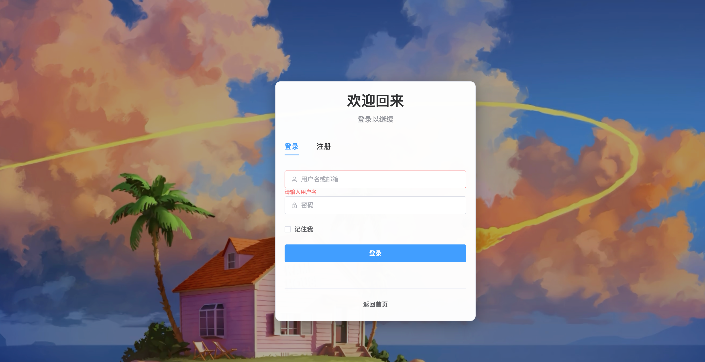

---

### 2. 控制台 (Dashboard)

系统首页，展示系统整体数据概览。

**功能特点：**
- 数据统计卡片
- 快捷操作入口
- 系统状态监控

**文件位置：** `src/views/dashboard/Index.vue`
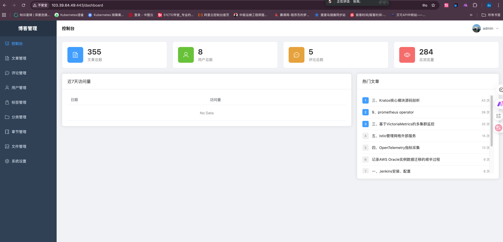

---

### 3. 文章管理

#### 3.1 文章列表

展示所有文章，支持搜索、筛选、编辑和删除操作。

**功能特点：**
- 分页列表
- 搜索功能
- 状态筛选
- 批量操作
- 快速编辑

**文件位置：** `src/views/article/Index.vue`

**路由：** `/articles`

**相关 API：** `src/api/article.js`

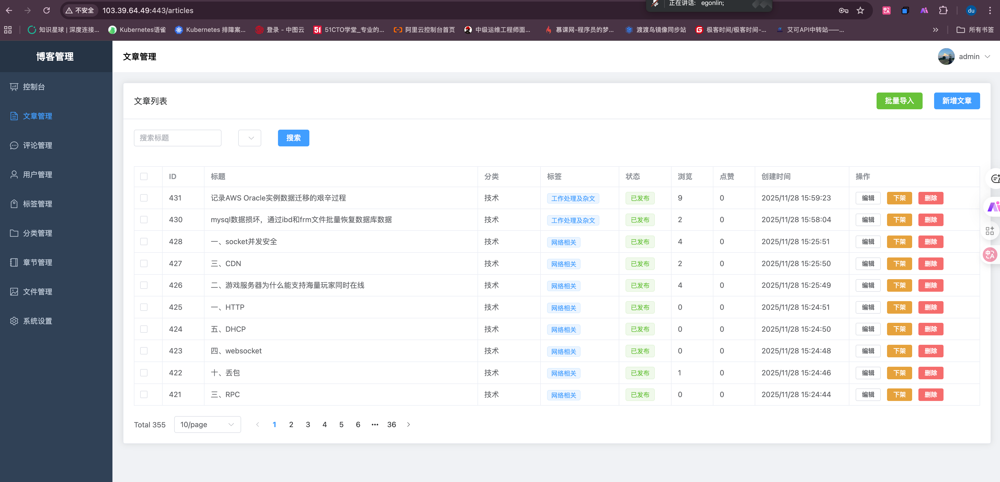

#### 3.2 文章编辑器

创建和编辑文章的编辑器页面，提供强大的 Markdown 编辑功能。

**功能特点：**
- Markdown 实时预览
- 代码高亮
- 图片上传
- 自动保存草稿
- 标签和分类选择
- SEO 配置

**文件位置：**
- `src/views/article/Edit.vue`
- `src/components/MarkdownEditor.vue`

**路由：**
- 创建：`/articles/create`
- 编辑：`/articles/:id/edit`

**使用的编辑器：**
- [md-editor-v3](https://imzbf.github.io/md-editor-v3/) - Markdown 编辑器
- [CodeMirror 6](https://codemirror.net/) - 代码编辑器核心

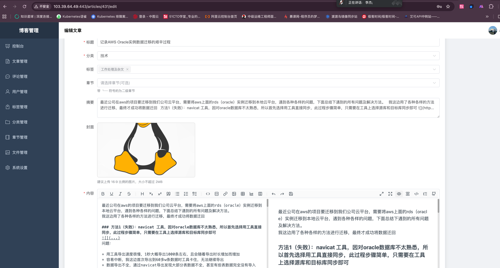

---

### 4. 用户管理

管理系统用户，包括用户信息维护和权限管理。

**功能特点：**
- 用户列表展示
- 用户信息编辑
- 用户状态管理
- 角色权限分配

**文件位置：** `src/views/user/Index.vue`

**路由：** `/users`

**相关 API：** `src/api/user.js`

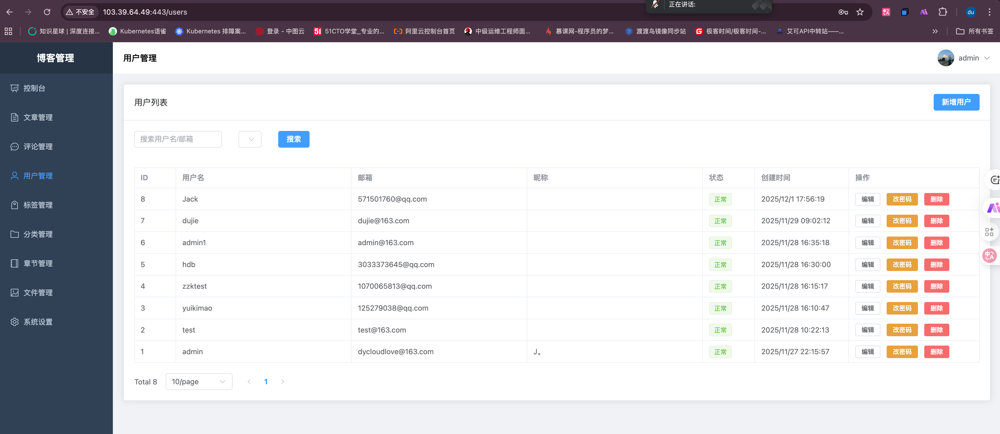

---

### 5. 评论管理

管理用户评论，支持审核和删除操作。

**功能特点：**
- 评论列表
- 评论详情查看
- 评论审核
- 批量删除

**文件位置：** `src/views/comment/Index.vue`

**路由：** `/comments`

**相关 API：** `src/api/comment.js`

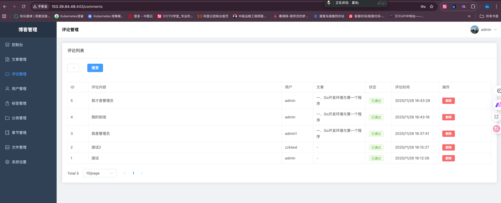

---

### 6. 标签管理

管理文章标签，用于文章分类和检索。

**功能特点：**
- 标签列表
- 添加/编辑/删除标签
- 标签统计

**文件位置：** `src/views/tag/Index.vue`

**路由：** `/tags`

**相关 API：** `src/api/taxonomy.js`

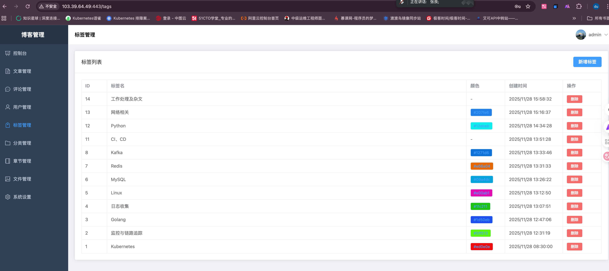

---

### 7. 分类管理

管理文章分类，支持层级分类。

**功能特点：**
- 分类列表
- 树形结构
- 添加/编辑/删除分类

**文件位置：** `src/views/category/Index.vue`

**路由：** `/categories`

**相关 API：** `src/api/taxonomy.js`

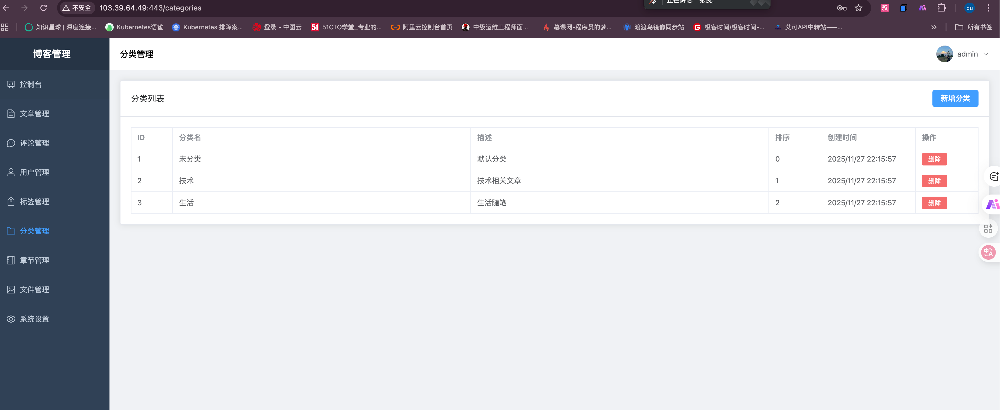


---

### 8. 章节管理

管理文章章节，用于组织系列文章。

**功能特点：**
- 章节列表
- 章节排序
- 章节编辑

**文件位置：** `src/views/chapter/Index.vue`

**路由：** `/chapters`

**相关 API：** `src/api/chapter.js`

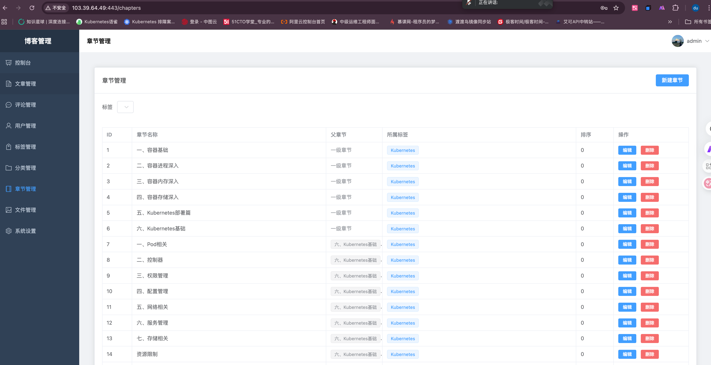

---

### 9. 文件管理

管理系统文件，包括图片、文档等。

**功能特点：**
- 文件上传
- 文件列表
- 文件预览
- 文件删除
- 文件搜索

**文件位置：** `src/views/file/Index.vue`

**路由：** `/files`

**相关 API：** `src/api/file.js`

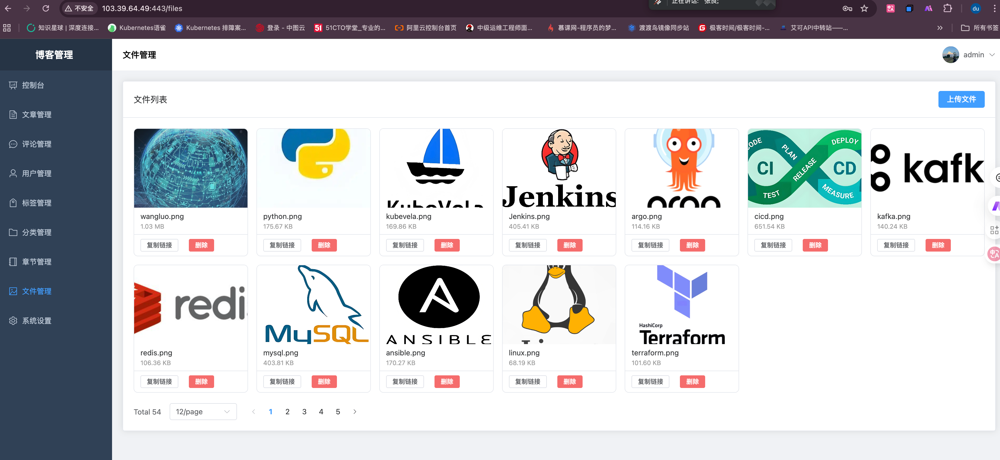

---

### 10. 系统设置

配置系统参数和网站信息。

**功能特点：**
- 网站基本信息
- SEO 设置
- 系统参数配置

**文件位置：** `src/views/settings/Index.vue`

**路由：** `/settings`

**相关 API：** `src/api/system.js`

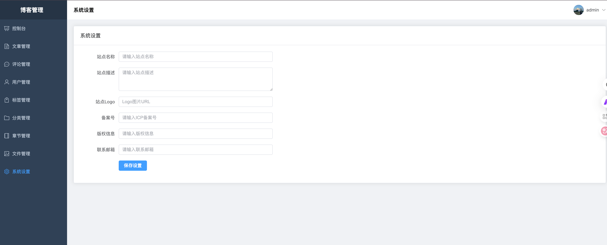

---

### 11. 个人中心

管理个人信息和账户设置。

**功能特点：**
- 个人信息修改
- 密码修改
- 头像上传

**文件位置：** `src/views/profile/Index.vue`

**路由：** `/profile`

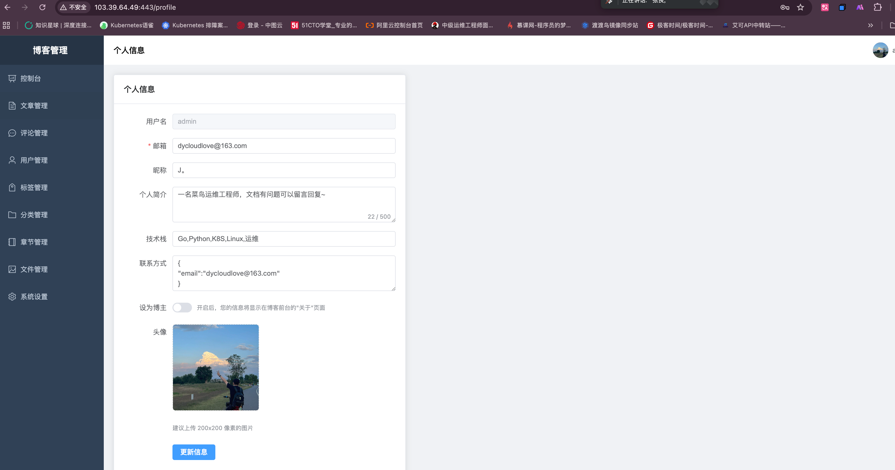

---

## ⚙️ 配置说明

### Vite 配置

`vite.config.js` 是 Vite 的配置文件，主要配置项：

```javascript
export default defineConfig({
  plugins: [vue()],              // Vue 插件
  resolve: {
    alias: {
      '@': fileURLToPath(new URL('./src', import.meta.url))  // 路径别名
    }
  },
  server: {
    port: 5173,                  // 开发服务器端口
    proxy: {                     // API 代理配置
      '/api': {
        target: 'http://localhost:8888',    // 后端服务地址
        changeOrigin: true,
        rewrite: (path) => path.replace(/^\/api/, '')
      },
      '/uploads': {              // 静态文件代理
        target: 'http://localhost:8888',
        changeOrigin: true
      }
    }
  }
})
```

### 路由配置

`src/router/index.js` 定义了所有路由规则：

**认证路由守卫：**
- 所有页面默认需要登录
- 未登录用户自动跳转到登录页
- 已登录用户访问登录页自动跳转到控制台

**路由配置示例：**
```javascript
{
  path: '/articles',
  name: 'Articles',
  component: () => import('@/views/article/Index.vue'),
  meta: { title: '文章管理' }
}
```

### API 配置

`src/utils/request.js` 封装了 Axios 实例：

**主要功能：**
- 请求拦截器：自动添加 Token
- 响应拦截器：统一错误处理
- 自动处理 401 未授权错误

**使用示例：**
```javascript
import request from '@/utils/request'

export function getArticles(params) {
  return request({
    url: '/api/articles',
    method: 'get',
    params
  })
}
```

### 状态管理

使用 Pinia 进行状态管理，`src/stores/user.js` 管理用户状态：

**主要功能：**
- 用户登录状态
- Token 管理
- 用户信息缓存

---

## 🐳 部署方式

### Docker 部署

#### 1. 构建 Docker 镜像

```bash
docker build -t leaf-admin:latest .
```

#### 2. 运行容器

```bash
docker run -d \
  --name leaf-admin \
  -p 80:80 \
  leaf-admin:latest
```

#### 3. 访问应用

打开浏览器访问 `http://localhost`

### Kubernetes 部署

查看 `deploy/k8s/` 目录下的 Kubernetes 配置文件。

```bash
kubectl apply -f deploy/k8s/
```

### Nginx 部署

#### 1. 构建项目

```bash
npm run build
```

#### 2. 配置 Nginx

参考 `deploy/nginx/nginx.conf` 配置文件：

```nginx
server {
    listen 80;
    server_name your-domain.com;
    root /usr/share/nginx/html;
    index index.html;

    # 处理 Vue Router 的 History 模式
    location / {
        try_files $uri $uri/ /index.html;
    }

    # API 代理
    location /api/ {
        proxy_pass http://backend-server:8888/;
        proxy_set_header Host $host;
        proxy_set_header X-Real-IP $remote_addr;
    }
}
```

#### 3. 复制构建文件

```bash
cp -r dist/* /usr/share/nginx/html/
```

#### 4. 重启 Nginx

```bash
nginx -s reload
```

---

## 👨‍💻 开发指南

### 代码规范

- 使用 ES6+ 语法
- 组件采用 Composition API
- 遵循 Vue 3 风格指南
- 使用 async/await 处理异步操作

### 组件开发

#### 创建新页面

1. 在 `src/views/` 下创建页面组件
2. 在 `src/router/index.js` 添加路由
3. 在 `src/api/` 创建相应的 API 接口

**示例：**

```vue
<!-- src/views/example/Index.vue -->
<template>
  <div class="example-container">
    <h1>{{ title }}</h1>
  </div>
</template>

<script setup>
import { ref } from 'vue'

const title = ref('示例页面')
</script>

<style scoped>
.example-container {
  padding: 20px;
}
</style>
```

### API 接口开发

在 `src/api/` 目录下创建 API 模块：

```javascript
// src/api/example.js
import request from '@/utils/request'

export function getList(params) {
  return request({
    url: '/api/examples',
    method: 'get',
    params
  })
}

export function create(data) {
  return request({
    url: '/api/examples',
    method: 'post',
    data
  })
}
```

### 状态管理

使用 Pinia 创建新的 store：

```javascript
// src/stores/example.js
import { defineStore } from 'pinia'

export const useExampleStore = defineStore('example', {
  state: () => ({
    data: []
  }),
  actions: {
    async fetchData() {
      // 获取数据
    }
  }
})
```

---

## ❓ 常见问题

### 1. 启动时端口被占用

**问题：** `Error: listen EADDRINUSE: address already in use :::5173`

**解决方案：**
```bash
# 查找占用端口的进程
lsof -i :5173

# 杀死进程
kill -9 <PID>

# 或修改 vite.config.js 中的端口号
server: {
  port: 3000  // 改为其他端口
}
```

### 2. 跨域问题

**问题：** API 请求出现跨域错误

**解决方案：**
- 检查 `vite.config.js` 中的 proxy 配置
- 确保后端服务地址正确
- 后端需要配置 CORS

### 3. 登录后立即退出

**问题：** 登录成功后立即跳转到登录页

**解决方案：**
- 检查 Token 是否正确保存到 localStorage
- 检查后端 Token 验证接口
- 查看浏览器控制台错误信息

### 4. 图片上传失败

**问题：** 文件上传返回错误

**解决方案：**
- 检查文件大小限制
- 确认后端上传接口正常
- 检查文件类型是否支持

### 5. 构建失败

**问题：** `npm run build` 构建失败

**解决方案：**
```bash
# 清除缓存
rm -rf node_modules
rm package-lock.json

# 重新安装依赖
npm install

# 重新构建
npm run build
```

---

## 📋 更新日志

### v1.0.0 (2025-12-01)

#### 新增功能
- ✨ 完整的用户认证系统
- ✨ 文章管理（CRUD）
- ✨ Markdown 编辑器
- ✨ 用户管理
- ✨ 评论管理
- ✨ 标签和分类管理
- ✨ 章节管理
- ✨ 文件管理
- ✨ 系统设置
- ✨ 个人中心

#### 技术改进
- 🚀 使用 Vue 3 Composition API
- 🚀 集成 Element Plus 组件库
- 🚀 使用 Vite 构建工具
- 🚀 使用 Pinia 状态管理
- 🚀 支持 Docker 部署

---

## 🤝 贡献指南

欢迎所有形式的贡献，无论是新功能、bug 修复还是文档改进。

### 贡献流程

1. **Fork 项目**
   ```bash
   # Fork 本仓库到您的 GitHub 账号
   ```

2. **克隆仓库**
   ```bash
   git clone https://github.com/ydcloud-dy/leaf-ui-backend.git
   cd leaf-ui-backend
   ```

3. **创建分支**
   ```bash
   git checkout -b feature/your-feature-name
   ```

4. **提交更改**
   ```bash
   git add .
   git commit -m "feat: 添加某某功能"
   ```

5. **推送分支**
   ```bash
   git push origin feature/your-feature-name
   ```

6. **创建 Pull Request**
   - 在 GitHub 上创建 PR
   - 填写详细的 PR 描述
   - 等待代码审查

### 提交信息规范

使用 [Conventional Commits](https://www.conventionalcommits.org/) 规范：

- `feat`: 新功能
- `fix`: Bug 修复
- `docs`: 文档更新
- `style`: 代码格式调整
- `refactor`: 代码重构
- `test`: 测试相关
- `chore`: 构建/工具链相关

**示例：**
```
feat: 添加文章搜索功能
fix: 修复登录页面样式问题
docs: 更新 README 文档
```

---

## 📄 许可证

本项目采用 [MIT License](LICENSE) 许可证。

---

## 📞 联系方式

如有问题或建议，请通过以下方式联系：

- 提交 [Issue](https://github.com/ydcloud-dy/leaf-ui-backend/issues)
- 发送邮件至：dycloudlove@163.com
- 📡：

---

## 🙏 致谢

感谢以下开源项目：

- [Vue.js](https://vuejs.org/)
- [Element Plus](https://element-plus.org/)
- [Vite](https://vitejs.dev/)
- [CodeMirror](https://codemirror.net/)
- [md-editor-v3](https://imzbf.github.io/md-editor-v3/)

---

<div align="center">

**⭐ 如果这个项目对你有帮助，请给我一个 Star！⭐**

Made with ❤️ by Leaf Team

</div>
